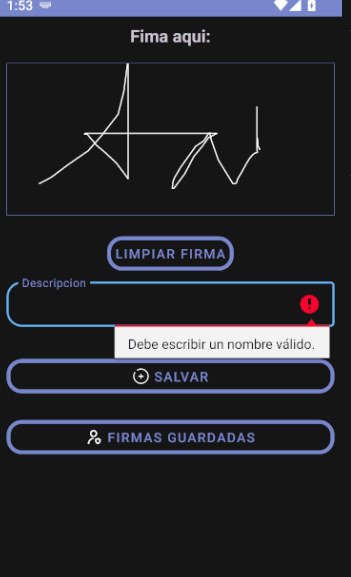

# Signature Pad

Captura firma del usuario.

## Capturas de Pantalla

## Capturas de Pantalla

## Características

- Captura firma del usuario
- Soporte para temas oscuros y claros
- Validación de errores y expresiones regulares
- Lector de firmas
- Conversor de imágenes a base64
- Almacenamiento de imágenes en SQLite

## Instalación

Para instalar este proyecto, simplemente clona este repositorio:

